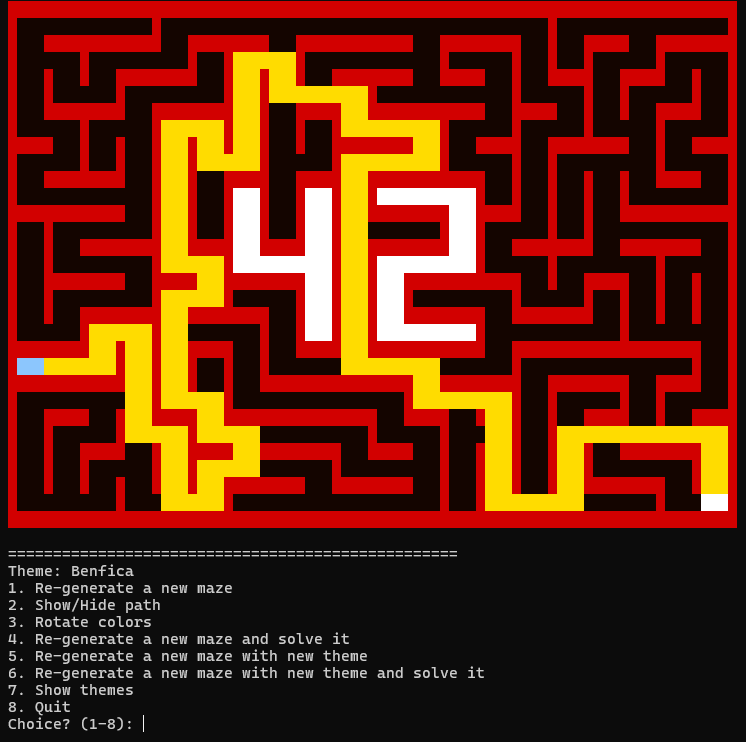

*This project has been created as part of the 42 curriculum by <a href ="https://github.com/sylvzzz">dbotelho</a> and <a href ="https://github.com/gboogzzz">gguia-ma</a>.*

---


# A-Maze-ing

> A maze generated in hexadecimal represented on the terminal via a `.txt` file with its properties and configs. A grid of hex values, an entry, an exit, a path, and the 42 logo, stamped in cell.



## Description

`A-Maze-ing` is a terminal-based maze generator and solver written in Python. It generates random mazes using depth-first search (recursive backtracker) to generate the maze, solves them via breadth-first search, and renders everything in your terminal with ASCII. There are multiple themes, a solution path you can toggle on and off, and — as a nod to 42 School — the number "42" is always stamped somewhere in the middle of the maze, made of blocked cells you can't walk through.

The project is split into a backend (generation, solving, encoding) and a frontend (rendering, themes, user interaction) and a middleware (parsing from files). The backend is also reusable as a module to future projects that will need maze generation, for example Pac-Man (Milestone 4)

# Maze represented in output file
```bash
293953D11579515553D3   # maze grid
AAAA9696E93C3AD5543A
C6AAC3A956C56C5513C2
93AAD46A97955553EABA
AEAC3950696D517A9686
C3C3AAFAFAFFFA96ABC3
943AC6FEF857FAA96A96
AD6C53FFFAFFFAAA946B
851796D3FAFD506AA93A
87A9693AFAFFFA96AAAA
E92A96C2D2D53C6BC6C2
96EC693C3C3945385396
851556C7C56853EC3C6B
C3C53939157ABA956D12
D457C6C6C5546C455568

0,0      # entry
19,14    # exit
SSENNESSSSSESSEESWSWSSENEN     # resolution 
```

---
# 🧱 Maze Hexadecimal Encoding Guide

Each cell of the maze is represented by a **single hexadecimal digit (0–F)**.  
This digit encodes which walls are **closed (1)** or **open (0)** using bits.

| Hex | Binary | North (N) | East (E) | South (S) | West (W) | Meaning |
|-----|--------|----------|----------|----------|----------|---------|
| 0   | 0000   | 0        | 0        | 0        | 0        | No walls |
| 1   | 0001   | 1        | 0        | 0        | 0        | North wall |
| 2   | 0010   | 0        | 1        | 0        | 0        | East wall |
| 3   | 0011   | 1        | 1        | 0        | 0        | North + East |
| 4   | 0100   | 0        | 0        | 1        | 0        | South wall |
| 5   | 0101   | 1        | 0        | 1        | 0        | North + South |
| 6   | 0110   | 0        | 1        | 1        | 0        | East + South |
| 7   | 0111   | 1        | 1        | 1        | 0        | North + East + South |
| 8   | 1000   | 0        | 0        | 0        | 1        | West wall |
| 9   | 1001   | 1        | 0        | 0        | 1        | North + West |
| A   | 1010   | 0        | 1        | 0        | 1        | East + West |
| B   | 1011   | 1        | 1        | 0        | 1        | North + East + West |
| C   | 1100   | 0        | 0        | 1        | 1        | South + West |
| D   | 1101   | 1        | 0        | 1        | 1        | North + South + West |
| E   | 1110   | 0        | 1        | 1        | 1        | East + South + West |
| F   | 1111   | 1        | 1        | 1        | 1        | All walls closed |

---

## 🧠 Bit Mapping

| Bit Position | Value | Direction |
|-------------|------|----------|
| 0 (LSB)     | 1    | North    |
| 1           | 2    | East     |
| 2           | 4    | South    |
| 3           | 8    | West     |

- **1 = wall closed 🚧**
- **0 = wall open 🚪**

---

## Instructions

### Requirements

- Python 3.10 or later
- No external dependencies needed(standard library only)

### Installation

```bash
# clone the repo
git clone git@github.com:sylvzzz/a-maze-ing.git a-maze-ing
cd a-maze-ing

# (optional but recommended) create a virtual environment
python3 -m venv test_env
source test_env/bin/activate

# install dependencies (if any are listed)
make install
```

### Running

```bash
python3 a_maze_ing.py config.txt
```

Or via the Makefile:

```bash
make run       # run with default config
make debug     # run with pdb debugger
make lint      # flake8 + mypy checks
make clean     # remove __pycache__, .mypy_cache, etc.
```

### Makefile targets

| Target | Description |
|--------|-------------|
| `install` | Install project dependencies |
| `run` | Run the main script |
| `debug` | Run with Python's built-in debugger (pdb) |
| `clean` | Remove caches and temp files |
| `lint` | Run `flake8` and `mypy` with required flags |
| `lint-strict` | Run `mypy --strict` (optional) |

---

## Configuration file format

The program takes a single config file as argument. Each line is a `KEY=VALUE` pair. Lines starting with `#` are ignored.

```ini
# example config.txt
WIDTH=20
HEIGHT=15
ENTRY=0,0
EXIT=19,14
OUTPUT_FILE=maze.txt
PERFECT=True
SEED=42           # optional — set for reproducible mazes
```

| Key | Type | Description | Example |
|-----|------|-------------|---------|
| `WIDTH` | int | Number of columns | `WIDTH=20` |
| `HEIGHT` | int | Number of rows | `HEIGHT=15` |
| `ENTRY` | x,y | Entry cell coordinates | `ENTRY=0,0` |
| `EXIT` | x,y | Exit cell coordinates | `EXIT=19,14` |
| `OUTPUT_FILE` | str | Where to write the maze | `OUTPUT_FILE=maze.txt` |
| `PERFECT` | bool | Single path between entry and exit | `PERFECT=True` |
| `SEED` | int | Optional seed for reproducibility | `SEED=12345` |

A default `config.txt` is included at the root of the repository.

---

## Maze generation algorithm

The algorithm used is **recursive DFS** (also known as the recursive backtracker).

It works like this: start from the entry cell, mark it as visited, then randomly pick an unvisited neighbor, break the wall between them, and recurse. When you hit a dead end, backtrack until you find a cell with unvisited neighbors. Repeat until all cells are visited.

Before the DFS runs, the "42" shape is stamped into the grid — those cells are pre-marked as visited so the DFS skips them entirely, leaving them as solid blocked regions.

If `PERFECT=False`, a second pass removes extra walls without creating open 2×2 areas, adding loops to the maze.

### Why this algorithm?

Recursive DFS was the right fit for this project for a few reasons. It's simple to reason about — the call stack is the frontier, so there are no extra data structures to manage. It produces long, winding corridors which look visually interesting in a terminal renderer. It integrates naturally with the "42" stamp: cells that are pre-marked visited are simply skipped by the DFS, so the pattern embeds without any special casing. And it's easy to make reproducible with a seed, which the subject requires.

Alternatives like Prim's or Kruskal's would produce different visual textures (more branchy, more uniform), but DFS gives the maze that classic labyrinthine feel.

---

## Output file format

```
<hex grid>      — HEIGHT lines, each with WIDTH hex chars, no separators
                — blank line
<ex>,<ey>       — entry position (col, row)
<xx>,<xy>       — exit position (col, row)
<directions>    — solution path as a string of N/S/E/W characters
```

Each cell's walls are encoded as a 4-bit hex value:

| Bit | Direction |
|-----|-----------|
| 0 (LSB) | North |
| 1 | East |
| 2 | South |
| 3 (MSB) | West |

`1` means the wall is closed, `0` means open. Example: `A` (binary `1010`) = East and West walls closed.

---

## Visual representation

The maze is rendered in the terminal using ANSI 24-bit background colors. Each cell is 3 characters wide with 1-character separators. Colors come from a theme dict and can be cycled at runtime.

```
====================
Theme: Ocean
1. Re-generate a new maze
2. Show/Hide path
3. Rotate colors
4. Quit
Choice? (1-4):
```

The "42" cells are rendered in the theme's `number` color — a distinct shade from the walls and passages, so the pattern is always visible.

### Themes

Themes live in `frontend/themes.py`. Each one is a dict of ASCII background codes:

| Key | Colors |
|-----|--------|
| `wall` | Maze walls |
| `passage` | Open corridors |
| `entry` | Start cell |
| `exit` | End cell |
| `number` | The 42 stamp |
| `path` | Solution path overlay |

Adding a new theme is just adding an entry to `THEMES` using the `bg(r, g, b)` function.

---

## Reusable module — `mazegen`

The maze generation logic is packaged as a standalone pip-installable module at the root of the repository: `mazegen-1.0.0-py3-none-any.whl` (and `.tar.gz`).

### Installation

```bash
pip install mazegen-1.0.0-py3-none-any.whl
```

### Building from source

```bash
pip install build
python3 -m build
# outputs dist/mazegen-1.0.0-py3-none-any.whl and dist/mazegen-1.0.0.tar.gz
```


## Project structure

```
.
├── a_maze_ing.py            # main program
├── config.txt               # default configuration file
├── Makefile
├── mazegen-1.0.0-py3-none-any.whl   # installable package
├── requirements.txt         # requirements for the project
├── maze_engine/
│   ├── maze.py              # Maze class — grid, stamp42, neighbors, walls
│   ├── cell.py              # Cell class — individual tile with wall state
│   ├── generator.py         # MazeGenerator — DFS + optional wall removal
│   ├── solver.py            # MazeSolver — finds the solution path
│   ├── encoder.py           # MazeEncoder — serializes maze to .txt format
│   ├── pipeline.py          # MazePipeline — orchestrates the whole flow
│   └── directions.py        # direction constants, moves, opposites
└── frontend/
    ├── __init__.py          # theme state, build_maze, render functions
    ├── themes.py            # color themes (Default, Ocean, Earthy, ...)
    ├── parsing.py           # config file parser and validator
    └── directions.py        # get_path — reconstructs cell coords from directions
```

---

## Team and project management

### Roles

| Member | Responsibilities |
|--------|-----------------|
| dbotelho | Frontend — ASCII renderer, themes, UI/UX and parsing |
| gguia-ma | Backend — maze generation, solver and encoder |

### Planning

Our plan to this project was just randomly coding parts of our structure, wich for many would seem badly planned, but for us was the simplest way to learn and get things done, we started out by randomly parsing the configs from the files, then proceded to study the algorithms (DFS and BFS), how to write "drawings" to the terminal, how to define diferent themes, and we both got our parts done, after testing with a lot of hardcode and thousands of `print()` we merged our branches and got our program running.

### What could be improved

As we both aren't always working at 42Lisbon all the time we could've planned better variable names, how the values were parsed and read.

For example my frontend read the maze grid and separated each charactes in the draw_maze with a space, and in the configs my colleage `gguia-ma` parsed the values to the class on lowercase, wich is common, but my dict of values (dict in python if you dont know is basicly the same structure as a `.json` file) parses them in uppercase as showed in the subject, so overall we should've planned better variables, functions etc.

### Tools used

- `mypy` for static type checking
- `flake8` for style linting
- Claude - faster debugging and bug fixing between `frontend` and `maze_engine`
- W3Schools - Mini tool for getting RGB colors, python functions and methods and much more

---

## Resources

- [RGB mini tool](https://www.w3schools.com/colors/colors_rgb.asp)
- [BFS Maze Algorithm](https://www.geeksforgeeks.org/dsa/breadth-first-search-or-bfs-for-a-graph/)
- [Claude](https://claude.ai)
- [Opencode](https://github.com/anomalyco/opencode)

### AI usage

Claude was used during this project for the following tasks:

- **Debugging the `stamp42` pipeline** — the coords were stored as `(x, y)` internally but the encoder was either not writing them at all (missing line in `encode()`) or writing them in the wrong order, causing the 42 to render as an empty set or inverted coordinates. Claude helped trace the bug through the encoder → file → renderer chain by inspecting each step in sequence.
- **Fixing the pipeline maze_engine → frontend in the renderer** — Looking at what we talked about in the improvements section claude helped us bringing the final pice all togheter

Opencode was used basicly used to helped us create the clearest documentation and README.md possible.

---

## Made by <a href ="https://github.com/sylvzzz">dbotelho</a> and <a href ="https://github.com/gboogzzz">gguia-ma</a>  @42Lisbon.